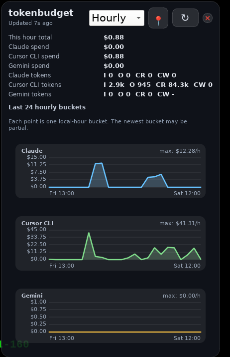

# tokenbudget

Small command-line utilities for summarizing AI token usage and cost from
local Claude Code transcripts and Cursor CLI dashboard exports.

## Scripts

### `claude_usage_costs.py`

Scans transcript files under `~/.claude/projects`, extracts per-response usage
records, de-duplicates repeated request entries, and estimates spend from
Anthropic pricing data fetched from `models.dev` or a local cache.

### `cursor_agent_usage_costs.py`

Fetches Cursor CLI usage as a CSV export from Cursor's dashboard API or reads
from a saved CSV file, then summarizes token totals and reported cost by event
kind and model.

### `gemini_usage_costs.py`

Scans local Gemini CLI session files under `~/.gemini`, estimates spend using
Google pricing from `models.dev`, and reports input, cached-read, and output
usage for the same hourly/daily/weekly/monthly monitor modes.

All scripts accept `--since` and `--until` filters using ISO-8601 timestamps
or natural-language expressions such as `2026-07-03`, `yesterday`, and
`1 hour ago`.

Natural-language parsing uses the Python `dateparser` package. On Fedora, install
it with `sudo dnf install python3-dateparser`.

## Qt Monitor

There is also a native Qt monitor under `desktop/` for a draggable transparent
desktop widget.

Install PySide6 on Fedora:

```bash
dnf install -y python3-pyside6
```

Then launch it:

```bash
./desktop/run-tokenbudget-qt.sh
```



The Qt monitor:

- can be dragged by its header and remembers its position
- stays transparent and borderless
- updates its graph data on refresh
- shows provider graphs for Claude, Cursor CLI, and Gemini, hiding any providers disabled in the RC file
- lets you switch the graph mode between `hourly`, `daily`, `weekly`, and `monthly`
- adds a tray icon on desktops that support system trays, with show/raise, hide, pin, refresh, restart, and quit actions

Useful options:

- `./desktop/run-tokenbudget-qt.sh --poll-seconds 60`
- `./desktop/run-tokenbudget-qt.sh --graph-mode hourly`

Optional monitor config lives in `~/.config/tokenbudget/qt-monitor.rc.py`. Example:

```python
SCALE = 2  # correct token double counting
DISABLED_PROVIDERS = {"cursor"}
```

All providers are enabled by default. Set `DISABLED_PROVIDERS` to any of
`claude`, `cursor`, and `gemini` to hide them and skip their backend refresh
work.

Right-click the widget for refresh, always-on-top, reset-position, and quit.
Closing the window hides it to the tray when a tray is available. Left- and
right-clicking the tray icon open the same menu; use that menu's `Quit` action
to exit fully.

## Packaging

Use Nuitka to build a single executable that bundles the Python runtime, PySide6,
and the non-stdlib dependencies used by the monitor and snapshot backends:

```bash
make build-deps
make onefile
```

The built executable is written to `dist/tokenbudget`. The GUI now reuses that
same executable for its background snapshot refreshes, so the packaged build
does not need a separate helper `.py` script at runtime.

On Linux, Nuitka still needs a working C toolchain and `patchelf` available on
the build machine.
